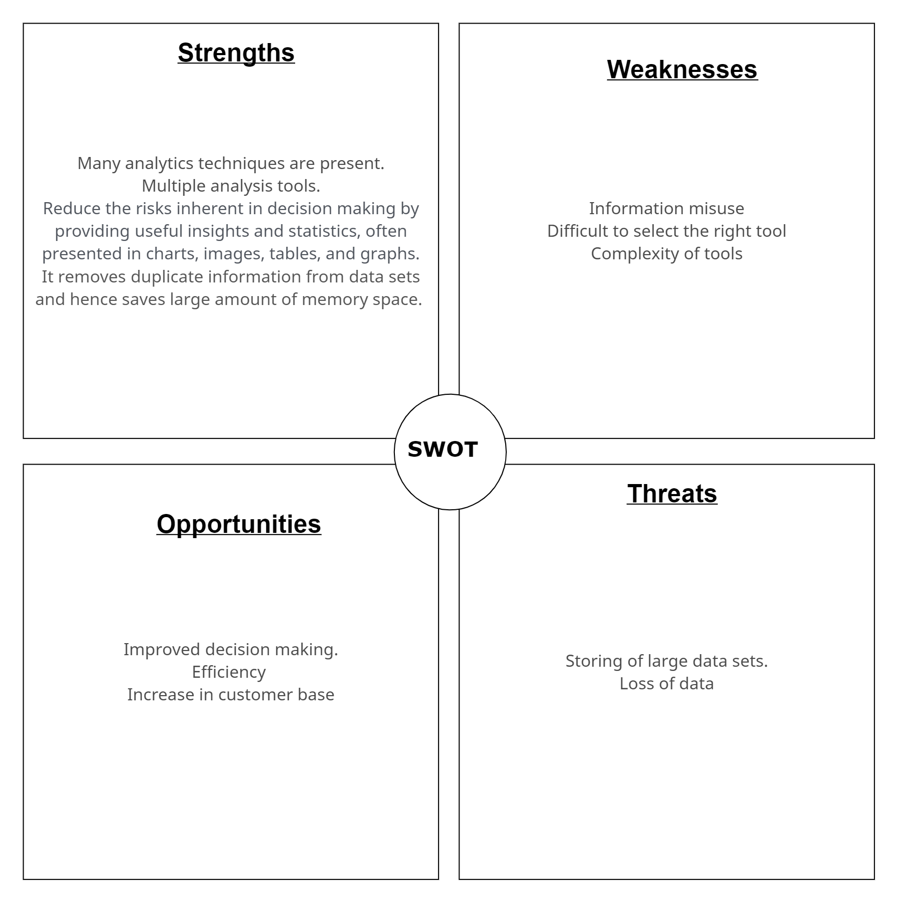

<<<<<<< HEAD
# Data Merge and Analysis
# Requirements
# Need
 # Introduction
 -Data Merging and analysis is used to manipulate data and display visual representation of the statistical analysis performed. 
 -Marks or score analysis is not only carried out in educational institutions as a metric for evaluation but also in other places where keeping a score is relevant. 
 -E-mailers are used to update concerned people by triggering e-mails after successful completion of the required manipulation.
   # HISTORY: 
   -The history of data analytics goes as far as the 19th century  
   -The measurement of assembly lines by Henry Ford was also designed based on the analytics 
## Research

-- Content 
## Cost and Features

-- Content 
## Defining Our System
    -- TBD
## SWOT ANALYSIS

# 4W and 1H

# What:

 - The data analysis process, or alternately, data analysis steps, involves gathering all the information, processing it, exploring the data, and using it for visualization.

# Why:

- Data analysis helps businesses improve their products and services. Can detect the strengths and weaknesses.

# When:

 - When a problem with a lot of complex operations and large number of data in unordered format is present.

# Where:

- Data Scientists and Analysts use data analytics techniques in their research, and businesses also use it to inform their decisions.

# How:
 - It is a way of thinking and resolving the problems. Includes setting goals, collecting, cleaning, and analyzing data, then visualizing it.

# Detail requirements
## High Level Requirements:

| **ID** | **Description** |
| --- | --- |
| HL1 | General Statistics  |
| HL2 | Student based data |
| HL3 |Auto Emails about the marks |

##  Low level Requirements:
| **ID** | **Description** |
| --- | --- |
| L1 | Marks for each student in every subject | 
| L2 | Spider chart for student |
| L3 | Spider chart for overall passed students in respective subjects |
| L4 | Merged document containing stats and visualization of data |
| L5 | Email alerts on low marks to student and teacher |
| L6 |Email alerts on demand |

